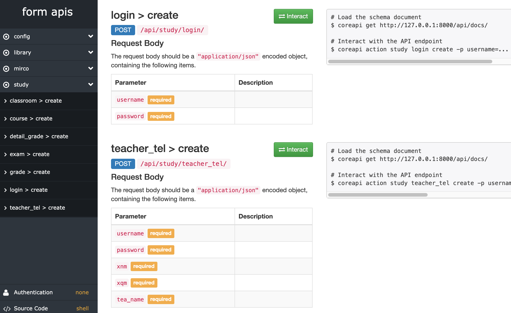

# pocketcumt_server

## 关于这个项目

口袋矿大 1.0 爬虫历史版本，由于一些安全、维护原因，此版本已不再更新（2020-03-24）。

仅留作纪念，所有爬虫链接均已去除，仅供交流学习，严禁用于商业用途与非法目录。

> 现已才用新的方式获取数据，目前更新至 2.0 版本。
> 
> Django back end of pocket cumt. Author: [PandaLzy](https://github.com/PandaLzy) & [zguolee](https://github.com/zguolee)

体验到微信搜索“**口袋矿大**”小程序


### API 文档



### 可以做什么

-   [x] 成绩与详情、考试时间、空教室、教师电话
-   [x] 图书馆藏
-   [x] 宿舍电量、校园贴士
-   [ ] ...

## 相关项目

[https://github.com/zguolee/pocketcumt_front](https://github.com/zguolee/pocketcumt_front)

## 开始启动

### 安装配置

1. clone the project

```sh
git clone https://github.com/Pandalzy/pocketcumt_server.git
```

2. enter the project directory

```sh
cd pocketcumt_server
```

3. install dependency

```sh
pip install -r requirements.txt
```

### 运行

```sh
python manage.py runserver
```

然后就可以打开浏览器查看 API 文档 [http://127.0.0.1:8000/api/docs/](http://127.0.0.1:8000/api/docs/)

## 许可

本项目使用开源许可证 License GPLv3 ，代码开源仅供学习。

## 致谢

- [Django](https://docs.djangoproject.com/en/3.1/)
- [django-rest-framework](https://www.django-rest-framework.org/)
